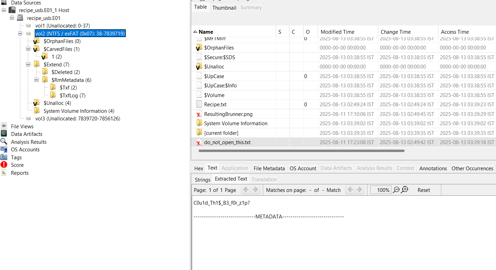
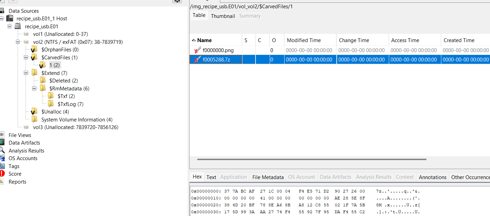

# Digging for Treasure

<!-- DESCRIPTION -->
> Last night I was out in the darkest of forests, located on Funen, digging for treasure. Lo and behold, I found this mysterious envelope with a note attached: "If you've found this by accident, please leave it where you found it. This is the best brunner recipe to ever be made, and the local baking-cartels have been looking for it, you'll be in great danger for possessing it."

> The envelope contained a USB-drive. Naturally, I needed to do an autopsy on this incredible find and plugged it straight into my PC, but it seems like all the good stuff's missing?


points: `40`

solves: `148`

handouts: [[recipe_usb.E01]()]

author: `Emil8250`

---

## Challenge Description

We are provided only a `.E01` or 'EnCase' image file. Another point to be noted is that the 'autopsy' in the challenge description was a link to the installation of the actual Autopsy software used for digital forensics.

--- 

## Solution

Since the autopsy link was a direct hint, I downloaded Autopsy and opened up the file in Autopsy. Now we snoop around.

First we find this deleted text file - 


This is obviously not the flag but let's keep this aside for later.

Some more snooping gives me this other deleted 7zip archive - 


When we extract this file and try to unzip it, we are prompted for a password. Looks like what we found before is gonna come in handy.

From here on out, we just open the unzipped folder and read the contents of flag.txt

--- 

```
brunner{cu$t4rd_1z_k1ng}
```

