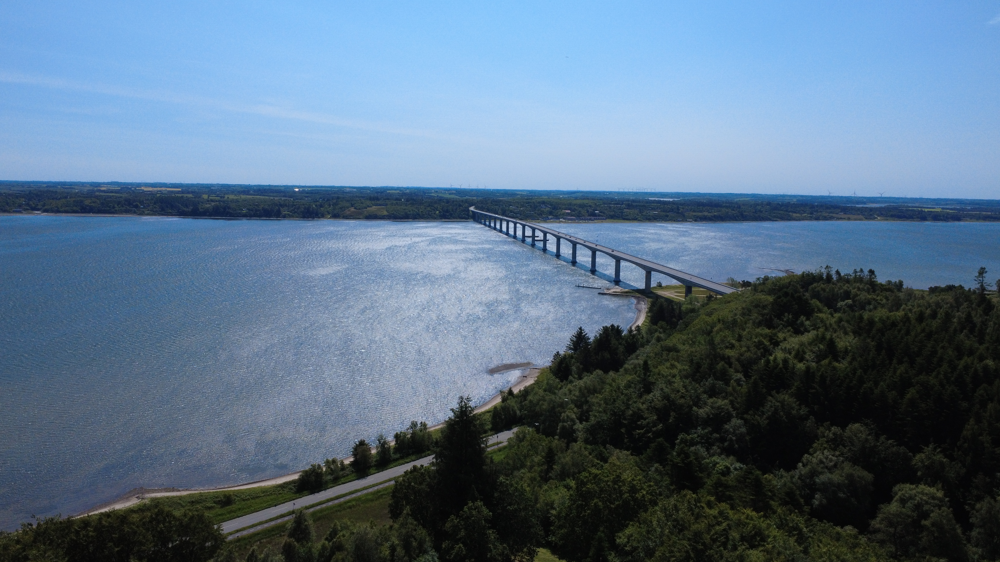

# There Is a Lovely Land

<!-- DESCRIPTION -->
> The Danish national anthem is called "Der er et yndigt land" ("There Is a Lovely Land"), and I fully agree.
A friend of mine took this picture, but I don't know the name of the bridge! Please help me find it so I can go see it!
Flag format: brunner{bridge name in Danish in lowercase}

points: `100`

solves: `526`

handouts: [`SomeBridge.JPG`]

author: `Toxicd`

---

## Challenge Description

Classic geoguesser challenge

---

## Solution



Using Google Lens directly points us to **Sallingsund Bridge (Sallingsundbroen)**

---

```
brunner{Sallingsundbroen}
```
