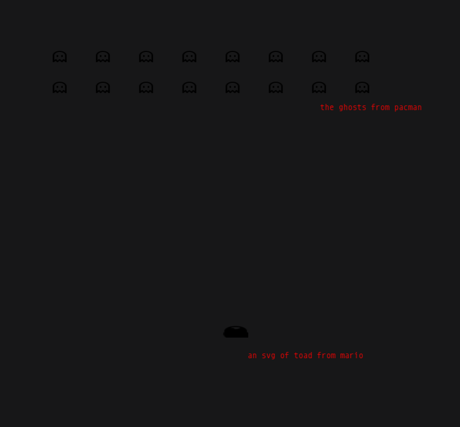
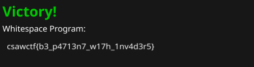

points: `463`

> [!warning]
> this challenge is the reason i am addicted to Monster

## The Handout

You are given a 31MB binary `whitespace_compiler` and a **344MB** `input.ws` which contained your whitespace input. Opening up the binary in Binary Ninja showed it was a Go binary.

## Analysis

You can immediately deduce this is some kind of VM challenge. And thankfully the binary wasn't stripped, so you could see functions like `whitespace_compiler/lexer.CleanAndParse` and `whitespace_compiler/vm.(*VM).Execute`. 

### Trying to Recreate the VM

I tried honestly, and I did figure out part of it. It was pretty similar to brainfuck with a large stack and each type of whitespace doing a specific operation on the stack, like `0x0b` would XOR the top two elements and put them back, something would increment, something would decrement, etcetera. I, however, wasn't clear enough with what was happening because the decompilation looked scary af, and also because I was scared of running a python VM with a **344MB** input file. Anyway here's the actual VM that was used in the source:

```go {title="vm.go" linenos=true hl_lines=["9-10"]}
type VM struct {
    array       []int
    currentIdx  int
    stack       []int
    output      strings.Builder
}

func (v *VM) Execute(program string) (error, string) {
    for iter, cmd := range program {
        time.Sleep(10*time.Millisecond)
        if (iter % 100 == 0) {
            fmt.Println("Done with", iter, "instructions out of", len(program))
        }
        switch cmd {
        case ' ':
            v.array[v.currentIdx]++
        case '\t':
            v.currentIdx++
            if v.currentIdx >= len(v.array) {
                v.array = append(v.array, 0)
            }
        case '\n':
            v.stack = append(v.stack, v.array[v.currentIdx])
            v.array[v.currentIdx] = 0
        case '\u00A0':
            // v.stack = v.stack[:len(v.stack)-1]
            if (v.currentIdx > 0) {
                v.currentIdx--
            }     
        case '\r':
            if len(v.stack) == 0 {
                return fmt.Errorf("stack underflow"), ""
            }
            top := v.stack[len(v.stack)-1]
            v.array[v.currentIdx] ^= top
        case '\x0B':
            v.array = []int{0}
            v.currentIdx = 0
        }
}

    // Convert array to characters
    for _, val := range v.array {
        v.output.WriteRune(rune(val))
    }
    
    return nil, v.output.String()
}
```

You may have noticed the highlighted lines, we'll come back to that later.

### Whitespace Esolang

When I wasn't able to reconstruct the VM, I took a break. That's when my teammate mentioned to me that there is an actual whitespace esoteric language, so I wondered if this was just an implementation of an actual esolang and spent SO MANY HOURS trying different whitespace interpreters on a **344MB** input file without crashing my computer.

[I got a lot of interpreters through here](https://esolangs.org/wiki/Whitespace). Eventually I convinced myself this wasn't going to work, and that they were two different languages anyway. (I spent so many hours :sob:)

### Giving up and Running the binary

Finally I tried to run the binary. 

```bash
2025/10/01 01:37:35   Cause: open assets/enemy.svg: no such file or directory
2025/10/01 01:37:35   At: /home/coding/go/pkg/mod/fyne.io/fyne/v2@v2.6.1/canvas/image.go:121
2025/10/01 01:37:35 Fyne error:  Failed to load image
```

It kept complaining about missing assets so I downloaded some random `.svg`s from the internet and shut it up. Now when I run it with 

```bash
❯ ./whitespace_compiler input.ws
```

it would give me a space invaders screen!



and when the game was over it would start compiling the `input.ws` file (VERY SLOWLY) and if you won it would print the output to your screen

```bash
Done with 15400 instructions out of 344002354
Done with 15500 instructions out of 344002354
Done with 15600 instructions out of 344002354
Done with 15800 instructions out of 344002354
Done with 15900 instructions out of 344002354
Done with 16000 instructions out of 344002354
Done with 16100 instructions out of 344002354
```

## The Exploit

So now we have a few attack options

- we could reconstruct the VM and compile the input file on our own (i gave up on this)
- we could just speed up the compilation step and then play the game

```go
time.Sleep(10*time.Millisecond)
```

This is the exact line we need to handle

```C
005258cf            rsi_1, arg1, zmm15_1 = time.Sleep(&data_989680, arg7)
```

Here's the relevant line the in the decompilation

```asm
0x005258ca      b880969800     mov eax, 0x989680
0x005258cf      e8ac84f5ff     call sym.time.Sleep
```

and here again in the assembly, where you can see the function argument being set for `time.Sleep()`

We can patch this binary with `pwntools`, here's my script.

```python {title="solve.py" linenos=true
from pwn import *

elf = ELF('./whitespace_compiler')

patch_addr = 0x5258ca
new_bytes = b'\xB8' + b'\x00\x00\x00\x00'
elf.write(patch_addr, new_bytes)

elf.save('./patched_binary')
```

and now running it, playing the game, and winning, give me the flag

---



```text
csawctf{b3_p4713n7_w17h_1nv4d3r5}
```
