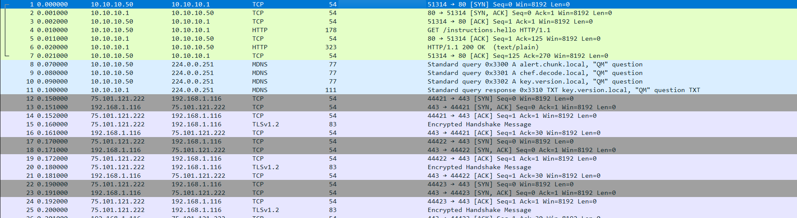
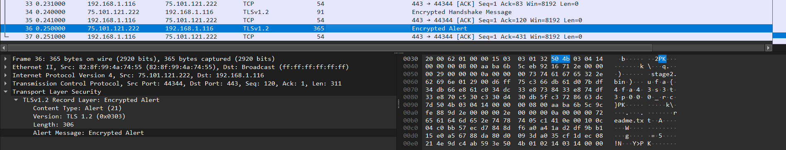

# Half Awake

<!-- DESCRIPTION -->
> Our SOC captured suspicious traffic from a lab VM right before dawn. Most packets look like ordinary client chatter, but a few are pretending to be something they are not.

points: `100`

solves: `433`

handouts: [`half-awake.pcap`]

author: `idk they didnt tell`

---

## Challenge Description

I really liked how beginner friendly this challenge was for pcap analysis.

--- 

## Solution

### The (not so required) First Step


Opening the pcap file shows us a bunch of HTTP packets, so I naturally decide to go look at the HTTP objects transferred (File > Export Objects > HTTP).

There turned out to be only one! A file called `instructions.hello` with the following content
```
Read this slowly:
1) mDNS names are hints: alert.chunk, chef.decode, key.version
2) Not every 'TCP blob' is really what it pretends to be
3) If you find a payload that starts with PK, treat it as a file
```

This strongly hints at a zip file being transferred (`PK` are the header bytes of a zip file chunk).

### Getting the Zip

There were many ways you can go about this, the simplest being just searching for the characters `PK` since the file is so small.\
It leads us to this large packet which seems to have a zip embedded in it.


Now we simply extract the bytes into a new file, and unzip it. This leads us to the next stage.

### Inside the Zip
```
$ file *
readme.txt: ASCII text
stage2.bin: Non-ISO extended-ASCII text, with no line terminators
```
Unzipping gives us access to two files, both having text.
The contents are as follows - 
- readme.txt
```
not everything here is encrypted the same way
```
- stage2.bin
```
u�f�a�{�4�f�a�4�3�s�3�t�3�p�0�0�0�_�r�c�}
```

`stage2.bin` looks a lot like our flag format, but the alternate characters seem to be off for some reason.\
My first thoughts go towards a shift or a XOR on each alternate character. Let's check the byte values - 


| Index |  Required  | Present | Difference | XOR |
|:-----:|:----------:|:-------:|:----------:|:---:|
|   1   | 0x74 ('t') |  0xc3   |     79     | 183 |
|   3   | 0x6c ('l') |  0xdb   |    111     | 183 |
|   5   | 0x67 ('g') |  0xd0   |    105     | 183 |


I guess it's pretty clear what's happening, so I wrote a quick little script to XOR every other character with 183.
```python
f = open('stage2.bin', 'rb').read()

assert f[0]==ord('u')

ans = ''

for i in range(len(f)):
    if i%2:
        ans += chr(f[i]^183)
    else:
        ans += chr(f[i])
        
print(ans)
```

--- 

```
utflag{h4lf_aw4k3_s33_th3_pr0t0c0l_tr1ck}
```

