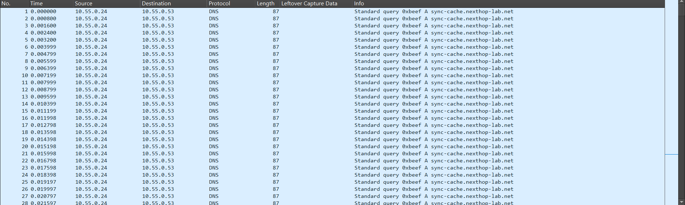
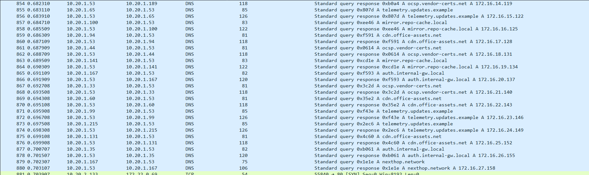
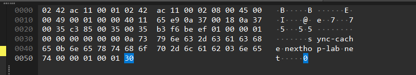
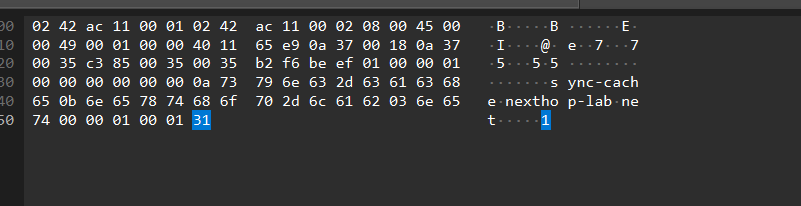

# Last Byte Standing

<!-- DESCRIPTION -->
> A midnight network capture from a remote office was marked “routine” and archived without review. Hours later, incident response flagged it for one subtle anomaly that nobody could explain. Find what was missed and recover the flag.

points: `100`

solves: `379`

handouts: [`last-byte-standing.pcap`]

author: `not mentioned again :(`

---

## Challenge Description

Another nice beginner challenge that I overthought.

--- 

## Solution

### DNS?
Starting off, when we look at our pcap file, we notice that there are a lot of DNS packets. And by that, I mean A LOT.



So there's obviously something wrong with these DNS queries, since this is not normal.

### My Unintended Solve

Initially, I thought that the title was a subtle reference to the LSB method of steganography, so I got a little script to extract the last bit of the first 500 packets as a check.
```py
from scapy.all import PcapReader, raw

pcap_file = "last-byte-standing.pcap"

nread = 0

with PcapReader(pcap_file) as pcap:
    for i, packet in enumerate(pcap):

        packet_bytes = raw(packet)

        if len(packet_bytes) > 0:

            last_bit = (packet_bytes[-1])%2

            nread += 1
            
            if nread==500:
                break
            
            print(str(last_bit), end = '')
```
Now I got the output as 
```
0111010101110100011001100110110001100001011001110111101101100100001100010110011101011111011101000011000001011111011101000110100000110011010111110110110000110100011100110111010001011111011000100111100101110100001100110111110101010101110000110101010111000011010101011100001101010101110000110101010111000011010101011100001100111010010101100011101001010110001110100101011000111010010101100011101001010110001110100101011000111010010101100101011011101110111011101110111011101110111011101110111011101110111
```

which when translated became
```
utflag{d1g_t0_th3_l4st_byt3}UÃUÃUÃUÃUÃUÃ:V:V:V:V:V:V:VVîîîîîîî
```

### The Intended Solve
Turns out, I was not very far off. Instead of a subtle reference to the last bit of every packet, the challenge name was actually a not-so-subtle reference to the last byte of every packet. Upon proper observation, you would see that the DNS packets each have a `0` or a `1` at the end of the packet.



The reason I got lucky was the fact that the last digit of the byte `0` is 0 and that of `1` is also 1. Which effectively led to me reading the same values.


--- 

```
utflag{d1g_t0_th3_l4st_byt3}
```

