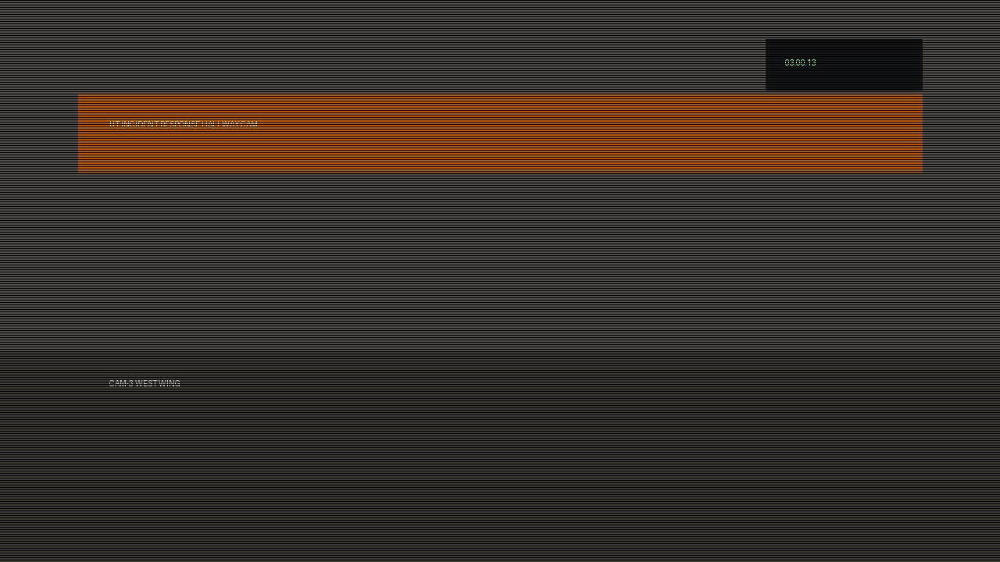

# Silent Archive

<!-- DESCRIPTION -->
> Incident response recovered a damaged archive from an isolated workstation. The bundle split into two branches during transfer: one looks like duplicate camera captures, and the other is an absurdly deep archive chain.
>
> Follow both trails, reconstruct the hidden message, and recover the token.

points: `100`

solves: `338`

handouts: [`freem4.zip`]

author: `idk`

---

## Challenge Description

Looks pretty straight forward. This is what we have inside the provided zip.
```sh
$ ls -l
total 10240
-rwxrwxrwx 1 pastimeplays pastimeplays   245760 Mar 17 23:00 File1.tar
-rwxrwxrwx 1 pastimeplays pastimeplays 10240000 Mar 17 23:00 File2.tar
-rwxrwxrwx 1 pastimeplays pastimeplays      159 Mar 17 23:00 README.txt
```

and this is what the README says - 
```
IR CASE 2026-0311
Recovered bundle from an isolated workstation.
Two archive branches survived transfer damage.
Investigate both and recover the report token.
```

--- 

## Solution

Let's start by unzipping each archive.
```sh
$ tar xvf File1.tar
cam_300.jpg
cam_301.jpg

$ tar xvf File2.tar
999.tar
```

### Archive 1

The first archive has two images - 



They look the same. I tried running `binwalk` on them to look for any hidden files, nothing turned up.\
Notice that we are dealing with `.jpg` images. A very common type of steganography with them is appending extra bytes after the image, since the file decides the end of the image by reading the magic bytes `0xff 0xd9`. This means that any data after this will always be ignored and have no visual effects.

Opening the file with a hex editor shows us this at the end of the first picture
```
---BEGIN-TELEMETRY---
TRACE_SEGMENT=A1f9z_Qp39_Xx2
cache_blob=q9A1eR2u4T6o8P0s
noise=R0xjODlhAQABAIAAAP///////ywAAAAAAQABAAACAkQBADs=
dbg_ptr=7f3c2d1a9b887766554433221100ffaa
cam_sig=ZXlKaGJHY2lPaUpJVXpJMU5pSjkuLi4
AUTH_FRAGMENT_B64:QWx3YXlzX2NoZWNrX2JvdGhfaW1hZ2Vz
---END-TELEMETRY---

```
The base64 fragment called `AUTH_FRAGMENT` looks like an interesting piece of base64. Let's convert it
```sh
$ echo "QWx3YXlzX2NoZWNrX2JvdGhfaW1hZ2Vz" | base64 -d
Always_check_both_images
```

Well... so we do the same with the other.
```sh
$ echo "MHI0bmczX0FyQ2gxdjNfVDRiU3A0Y2Uh" | base64 -d
0r4ng3_ArCh1v3_T4bSp4ce!
```

### Archive 2
Archive 2 has a `999.tar` inside it, and when I checked inside that, it had a `998.tar`. I guess we both know where this is going.
```sh
while f=$(ls *.tar); do tar xvf "$f" && rm "$f"; done
```
This stores the current `.tar` file in a variable f, untars it, and deletes it recursively.

After extracting the entire chain, we are left with a `Noo.txt` that's actually a password protected zip file. Take a wild guess as to what the password is.
```sh
$ unzip Noo.txt
Archive:  Noo.txt
[Noo.txt] NotaFlag.txt password:
```
### Almost done
The `NotaFlag.txt` is opened, but it looks blank. That's cos the entire message is written with whitespace characters (the 58 lines gives it away). \
This was a simple substitution because if you look closely, the message is entirely tabspaces and normal spaces. Furthermore, there are 8 of them every line. \
Trying a simple binary substitution (space for `0` and tabspace for `1`) gives us a list of 58 bytes (in binary). \
That's it. \
That's the flag 

--- 

```
utflag{d1ff_th3_tw1ns_unt4r_th3_st0rm_r34d_th3_wh1t3sp4c3}
```

