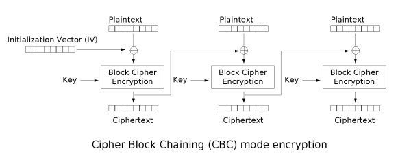
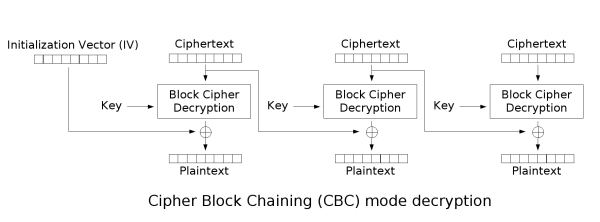
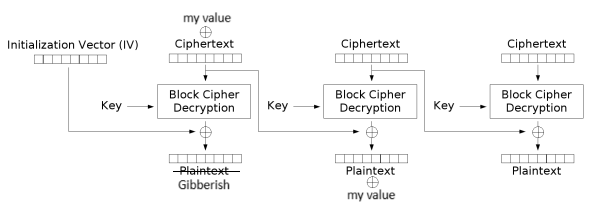

# EaaS

<!-- DESCRIPTION -->
> Email as a Service! Have fun...

points: `484`

solves: `100`

handouts: [`server.py`,`flag.txt`]

author: `NoobMaster`

---

## Challenge Description

server.py contains the code for an interactive server which seemingly allows us to set a password for the randomly generated email we are assigned, check our emails and get the flag if certain conditions are met.

``` python
#!/usr/bin/env python3
from Crypto.Cipher import AES
from Crypto.Util.Padding import pad, unpad
import os
import random
email=''
flag=open('flag.txt').read()
has_flag=False
sent=False
key = os.urandom(32)
iv = os.urandom(16)
encrypt = AES.new(key, AES.MODE_CBC,iv)
decrypt = AES.new(key, AES.MODE_CBC,iv)

def send_email(recipient):
    global has_flag
    if recipient.count(b',')>0:
        recipients=recipient.split(b',')
    else:
        recipients=recipient
    for i in recipients:
        if i == email.encode():
            has_flag = True

for i in range(10):
    email += random.choice('abcdefghijklmnopqrstuvwxyz')
email+='@notscript.sorcerer'

print(f"Welcome to Email as a Service!\nYour Email is: {email}\n")
password=bytes.fromhex(input("Enter secure password (in hex): "))

assert not len(password) % 16
assert b"@script.sorcerer" not in password
assert email.encode() not in password

encrypted_pass = encrypt.encrypt(password)
print("Please use this key for future login: " + encrypted_pass.hex())

while True:
    print(f"[1] Check for new messages\n[2] Get flag")
    choice = int(input("Enter your choice: "))
    

    if choice == 1:
        if has_flag:
            print(f"New email!\nFrom: scriptsorcerers@script.sorcerer\nBody: {flag}")
        else:
            print("No new emails!")

    elif choice == 2:
        if sent:
            exit(0)
        sent=True
        user_email_encrypted = bytes.fromhex(input("Enter encrypted email (in hex): ").strip())
        if len(user_email_encrypted) % 16 != 0:
            print("Email length needs to be a multiple of 16!")
            exit(0)
        user_email = decrypt.decrypt(user_email_encrypted)
        if user_email[-16:] != b"@script.sorcerer":
            print("You are not part of ScriptSorcerers!")
            exit(0)

        send_email(user_email)
        print("Email sent!")
```

The flag.txt file just shows us the flag format
```scriptCTF{flag}```

--- 

## Solution

This challenge targets the core weakness of Cipher Block Chaining or CBC modes of encryption. So before we get to the solution, let's discuss what the CBC mode of encryption is.

### Block Ciphers
Block ciphers are methods of encryption where the plaintext is split into "blocks" of a fixed size and each block is encrypted individually before being brought together to form the ciphertext. We most commonly use block ciphers in our day to day life as it requires a small key size and is therefore faster to compute. However, there are multiple ways to carry out encryptions even with block ciphers.

One of the simplest methods is to literally just encrypt every block independently from the others and concatenate the results together. This mode is called the ECB(Electronic Code Book) method of encryption. However this poses a major risk! If I encrypt a message which has the same block in two different locations, their ciphertext will stay the same. In other words, if I have seen a plaintext-ciphertext pair before, and I see the same ciphertext somewhere else, I know what the plaintext is!

There are multiple alternate methods used to combat this and try to reduce context while encrypting. Some of the most famous modes are the CBC(Cipher Block Chaining) and CTR(Counter) modes.

### AES - CBC
AES is one of the most widely used encryption schemes in the current day. This is attributed to the fact that it has been proven to be secure so far. Keeping this is mind, you can safely assume that since the challenge uses AES in the CBC mode, there is nothing you can do when it comes to the actual AES algorithm. What you need to target is the CBC implementation.



To introduce a level of secrecy, we use the previous block's ciphertext to mask the current block by XORing them together before we encrypt it.

That said, this also gives me some power to modify a few blocks if I know the plaintext, and that is what this challenge is all about.


### Conditions For Getting the Flag
First of all, I have no information about the key and IV(refer to above image) used for the current cipher, so it is no use trying to recover them. Concentrate on the CBC section, more specifically, the XORing operation. 

```python
user_email_encrypted = bytes.fromhex(input("Enter encrypted email (in hex): ").strip())
if len(user_email_encrypted) % 16 != 0:
    print("Email length needs to be a multiple of 16!")
    exit(0)
user_email = decrypt.decrypt(user_email_encrypted)
if user_email[-16:] != b"@script.sorcerer":
    print("You are not part of ScriptSorcerers!")
    exit(0)

send_email(user_email)
print("Email sent!")
```
I need to provide a ciphertext, which when decrypted by their cipher, should produce a valid email id, namely, it should end with `@script.sorcerer`. The length being a multiple of $16$ is trivial as we need to ensure the ciphertext can be divided into blocks of $16$ bytes anyways.

```python
def send_email(recipient):
    global has_flag
    if recipient.count(b',')>0:
        recipients=recipient.split(b',')
    else:
        recipients=recipient
    for i in recipients:
        if i == email.encode():
            has_flag = True
```
I also seem to have the option of entering multiple emails separated by a `,`, and the flag will be sent to all the recipients. 

### Provided Features
We can also make the code do something for us.
```python
print(f"Welcome to Email as a Service!\nYour Email is: {email}\n")
password=bytes.fromhex(input("Enter secure password (in hex): "))

assert not len(password) % 16
assert b"@script.sorcerer" not in password
assert email.encode() not in password

encrypted_pass = encrypt.encrypt(password)
print("Please use this key for future login: " + encrypted_pass.hex())
```
Using the same cipher, we can make the server encrypt a string for us as long as it does not violate a few conditions - 
- Its length should be a multiple of 16
- I cannot put `@script.sorcerer` in the plaintext (There go my hopes of getting that block encrypted)
- I also cannot enter use email they have provided as part of the password to be encrypted

### Building The Password (Idea)
The above descriptions help you realise a couple interesting things. When my 'encrypted email' is decrypted, it should -
- contain my randomly generated email as a recipient, in other words, `<something>,<my email>,<somthing>`
- also end with `@script.sorcerer`, which I cannot do with my email as it ends with `@notscript.sorcerer` 

But I'm not allowed to encrypt my email id or `@script.sorcerer`, so I have to look for a way to get something encrypted, then modify THAT to make sure I end up with what I want. This is where the XORing comes into play.

The normal decryption works something like this - 



But what if I decide to XOR the first ciphertext block with some value? What would its effects be?



Now AES is technically a mapping between blocks, but unless I know the key, I don't know which plaintext blocks are being mapped to which ciphertext blocks. So if I XOR a block with my value, I lose the original ciphertext block, and now its decryption is something random BUT I also managed to influence the next plaintext block. 

This means that as long as I don't care about my current plaintext block, I can make the next plaintext block whatever I want it to be.


### Building The Password (Structure)
Now the question is how and what do I split into blocks? For the blocks about which I will be using to manipulate the ciphertext, I will be making them `AAAAAAAAAAAAAAAA`.

Also, I can't make my first block a useful one since I don't know the IV used and can't manipulate the plaintext. For the purpose of this example, the email ID I recieved was `cgfonjrzep@notscript.sorcerer`


The conditions I require are that when my provided ciphertext is decrypted, it must -

1. End with `@script.sorcerer`
2. Have my email ID within commas - `,cgfonjrzep@notscript.sorcerer,`

My required output - 

`<don't care>` &nbsp;&nbsp; `,cgfonjrzep@nots` &nbsp;&nbsp; `cript.sorcerer,A` &nbsp;&nbsp; `<don't care>` &nbsp;&nbsp; `@script.sorcerer`

So I can create my password input as -

`AAAAAAAAAAAAAAAA` &nbsp;&nbsp; `AAAAAAAAAAAAAAAA` &nbsp;&nbsp; `cript.sorcerer,A` &nbsp;&nbsp; `AAAAAAAAAAAAAAAA` &nbsp;&nbsp; `AAAAAAAAAAAAAAAA`

The reason for keeping the `cript.sorcerer,A` block in my input is the fact that if I tried to mess with the plaintext value of that particular block, I would get gibberish plaintext for the block before it, so I wouldn't be able to form my entire email.

Now, I get the encrypted plaintext from the server and I XOR my -
- 1st ciphertext block with `AAAAAAAAAAAAAAAA` ⊕ `,cgfonjrzep@nots`. This results in my 2nd block being decrypted to 

`AAAAAAAAAAAAAAAA` ⊕ `AAAAAAAAAAAAAAAA` ⊕ `,cgfonjrzep@nots` = `,cgfonjrzep@nots`

- 4th ciphertext block with `AAAAAAAAAAAAAAAA` ⊕ `@script.sorcerer`. This results in my 5th block being decrypted to 

`AAAAAAAAAAAAAAAA` ⊕ `AAAAAAAAAAAAAAAA` ⊕ `@script.sorcerer` = `@script.sorcerer`

Once I process my ciphertext, it should decrypt to the form I mentioned in my required output. Here is the script I used to calculate it.
```python
from Crypto.Util.number import *

def xor(a,b,d):                                                              # Function to XOR 3 blocks
    c = b''
    for i in range(16):
        c += int.to_bytes(a[i]^b[i]^d[i])
    return c

def craft():
    email = b'cgfonjrzep@notscript.sorcerer'                                 # The email ID I recieved
    cthex = 'c390e7cbfda1aa692c4ae0e62758b858d27bdf2aec316101de35d9ef8e4a4317a0cb01745d767da4eef8b33f76ee6cfd9656764e06d5a1c60081ead3bd24503a51723afe2e5223eaf13ab7bbd1290592'                                                                # The ciphertext I recieved
    ct = [bytes.fromhex(cthex[i:i+32]) for i in range(0,len(cthex),32)]      # Convert into byte blocks of size 16
    assert len(ct)==5
    pl = b''
    temp = b','+email[:15]                                                   # temp contains my target block
    inp = b'A'*16                                                            # inp contains the block I had provided as input
    pl += xor(ct[0],inp,temp)                                                # Add the modified block to manipulate output
    pl += ct[1]
    pl += ct[2]
    temp = b'@script.sorcerer'
    pl += xor(ct[3],inp,temp)                                                # Repeat to get the last block right
    pl += ct[4]
    
    print(hex(bytes_to_long(pl))[2:])                                        # Give new ciphertext in hex (server was taking hex input)
    
craft()
```

The server interaction looked something like this 

```
Welcome to Email as a Service!
Your Email is: cgfonjrzep@notscript.sorcerer

Enter secure password (in hex): 414141414141414141414141414141414141414141414141414141414141414163726970742e736f7263657265722c414141414141414141414141414141414141414141414141414141414141414141
Please use this key for future login: c390e7cbfda1aa692c4ae0e62758b858d27bdf2aec316101de35d9ef8e4a4317a0cb01745d767da4eef8b33f76ee6cfd9656764e06d5a1c60081ead3bd24503a51723afe2e5223eaf13ab7bbd1290592
[1] Check for new messages
[2] Get flag
Enter your choice: 2
Enter encrypted email (in hex): aeb2c1ecd38e815a176ed1e708768d6ad27bdf2aec316101de35d9ef8e4a4317a0cb01745d767da4eef8b33f76ee6cfd9764547d2ee494a932afd9f19917740951723afe2e5223eaf13ab7bbd1290592
Email sent!
[1] Check for new messages
[2] Get flag
Enter your choice: 1
New email!
From: scriptsorcerers@script.sorcerer
Body: scriptCTF{CBC_1s_s3cur3_r1ght?}

```

--- 

```
scriptCTF{CBC_1s_s3cur3_r1ght?}
```

