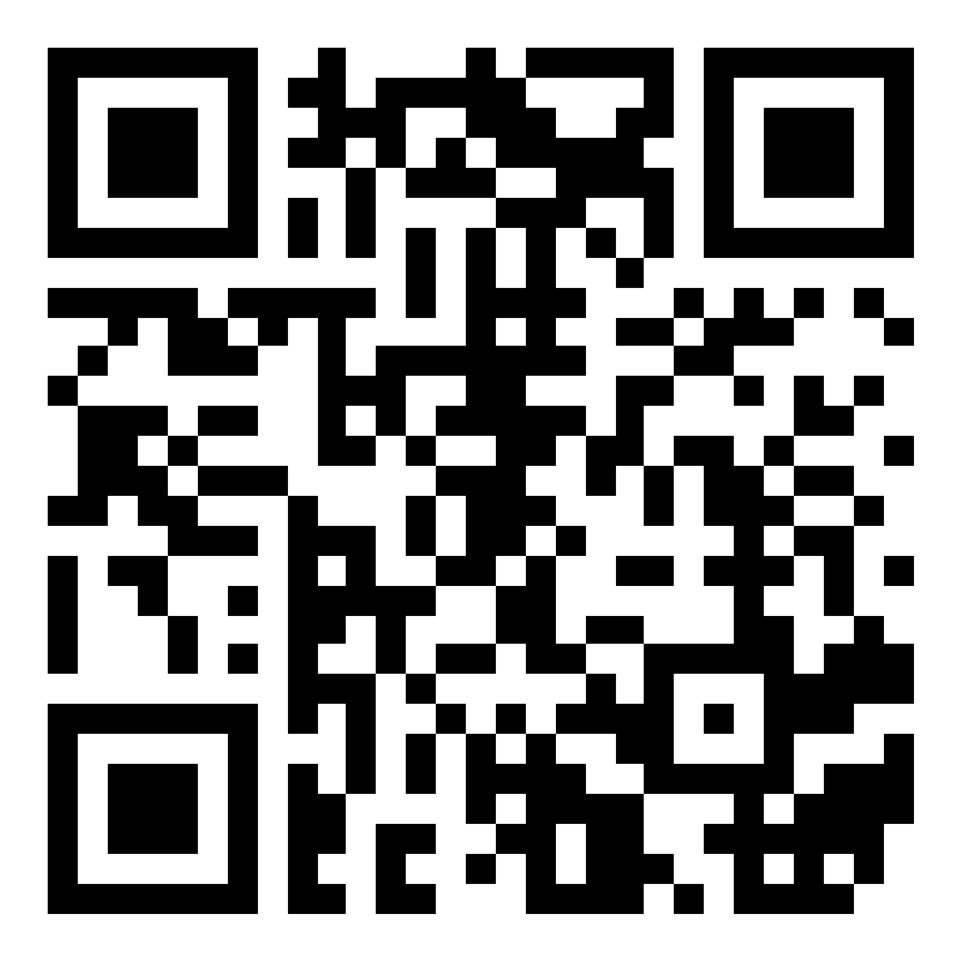
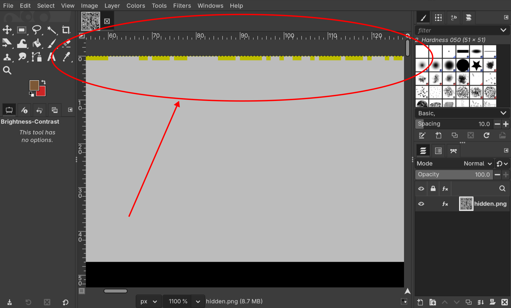
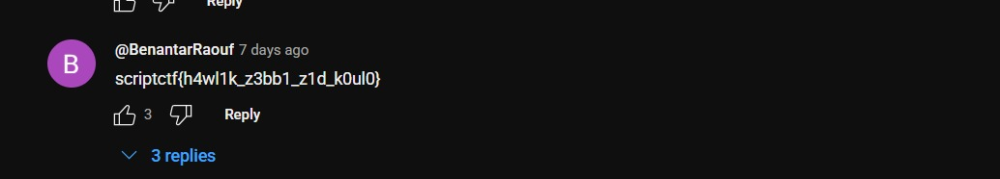

# OffByOne

> i hid a qr inside a qr

points: `497`

solves: `44`

author: `Connor Chang`

## Solution

Honestly very simple, i can't believe we were the 6th solve

We were given `hidden.png` which contains a qr that rick rolls you (i'm so proud i didn't fall for this)

{}



{}

OffByOne implies lsb stego, opening up in gimp and turning on high contrast showed some stuff going on in the top row of pixels



The description immediately made me think this reshapes into a qr, so i checked if there was a perfect square, and yes, this weird yellow row continues for 841 pixels which is \\(29^2\\)

```py {title="solve.py" linenos=true}
from PIL import Image

im = Image.open("./hidden.png")
width, height = im.size
pixels = im.load()

for x in range(0, 841):
    if x % 29 == 0:
        print()
    r, g, b = pixels[x, 0]
    if b == 255:
        print(1, end='')
    else:
        print(0, end='')

```

```bash
python solve.py > qr.txt
```

Then opening up in  [QRazybox](https://merri.cx/qrazybox/)

New -> Import from Text, then Tools -> Extract QR Information gives the flag

```
scriptCTF{qrqrqrc0d3s}
```

---

someone put a fake flag in the comments lol


